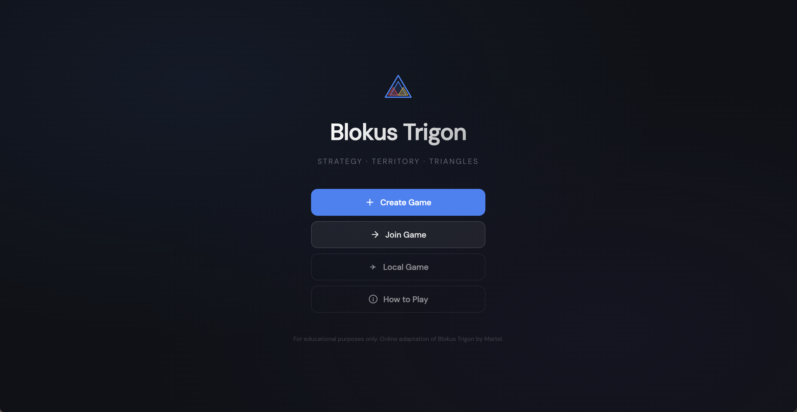
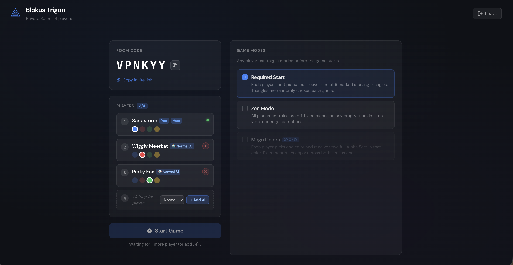
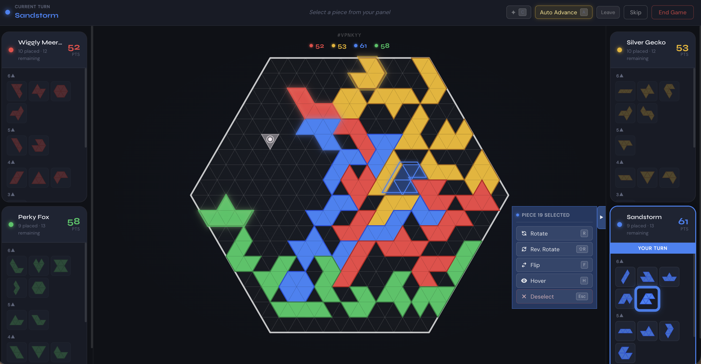
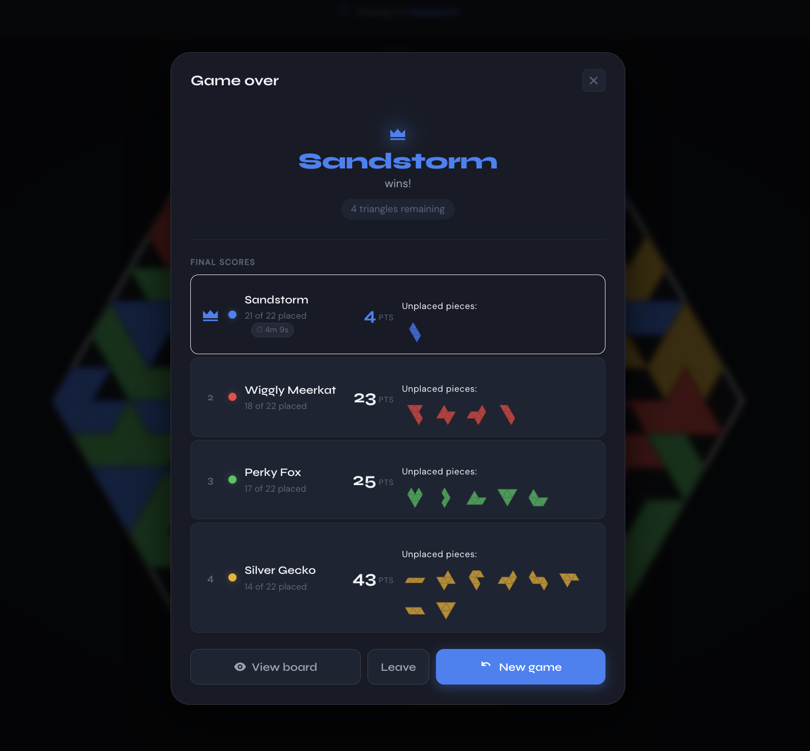

# Blokus Trigon

**STRATEGY · TERRITORY · TRIANGLES**

 

<!--
  Replace the href URL with your live deployment URL, e.g. https://blokus-trigon.vercel.app
-->

  

---

 Home screen

  

 Room creation &amp; lobby

  

 Gameplay

  

 Game over &amp; final scores

---

*For educational purposes only. Online adaptation of Blokus Trigon by Mattel.*
