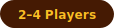

# Blokus Trigon

STRATEGY · TERRITORY · TRIANGLES

 

  

---

 Home screen

  

 Room creation &amp; lobby

  

 Gameplay

  

 Game over &amp; final scores

---

*For educational purposes only. Online adaptation of Blokus Trigon by Mattel.*
